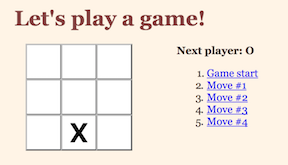

# Lab: Tic-Tac-Toe

Let's practice from an existing codebase.

This repository contains the code for existing tic tac toe game programming in JavaScript using React. You can see it running [here](https://susiremondi.github.io/tictacReact/).

You'll be adding a feature to this game.

This tic-tac-toe game currently:

* lets you play tic-tac-toe
* indicates when one player has won the game
* stores the history of moves during the game

### Setting up

* Fork and clone this repository.

* You can run this with `npm start` from inside the `tictactoe` directory.

### Task

Your job is to allow players to jump back in time to see older versions of the game board.

Each move in the move list should be a link to jump back to that move. If you click any move link, the board should immediately update to show what the game looked like at that time.

Also, update `handleClick` so that when reading the current board state when you can go back in time, you can then click in the board to create a new entry.

**You can see the desired solution [here](https://susiremondi.github.io/tictacSolution/)**

Note that the steps past the one you jump to do not need to disappear off the list. That is to say, from a board that looks like this:

Clicking on `Move #1` causes the board to jump back in time to move #1, but the move list has not changed.

However, from there the game can be played and new moves can then be overwritten in the history.

Try it yourself in the solution link above.

### Hints

Note: In the code, a 'move' is also referred to as a 'step'.

In the repository root folder, there is a file called `"hints.rtf"` which includes a breakdown (in English!) of what needs to be done.

## Solution

Solution code is provided in the `solution_src` folder of this repository. Please give this your best go before looking! A Changelist is also provided in that folder with a brief explanation.

This project was based off [this Facebook tutorial](https://facebook.github.io/react/tutorial/tutorial.html
). Click inside the link to see a thorough step by step tutorial of building out this tic tac toe app - note that in the tutorial, they don't split the components into different files.

*NOTE* The walk through for this question is also in this tutorial (near the end), so don't look until you've given it a thorough try!
